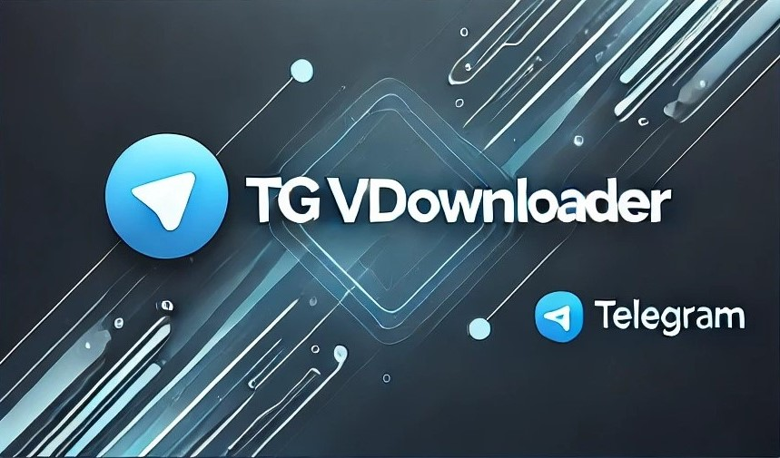

# [Telegram] TG-VDownloader

<div style="text-align: center;">
  
</div>

<br>

**Descrição:** Este projeto é uma aplicação simples que permite baixar vídeos de um canal do Telegram utilizando a biblioteca Telethon.  

**Tecnologias utilizadas:** Python  
**URL para Acesso à API:** [my.telegram.org](https://my.telegram.org/)  
**Documentação Telethon:** [telethon](https://docs.telethon.dev/en/stable/)  

<BR>

## MODO DE USO

A aplicação recebe parâmetros via linha de comando para configurar a conexão e identificar o canal de onde os vídeos serão extraídos. Todavia, é muito importante se atentar para alguns pontos específicos. Antes de citá-los, vamos para um passo-a-passo:

1. Faça o download do arquivo em um local acessível no seu disco rígido. Em seguida, acesse o seu prompt de comando (cmd)

<br>

2. Navegue para o diretório onde o arquivo está por meio do seguinte comando:

```bash
cd "C:\diretorio\onde\o\arquivo\esta"
```

<br>

3. Escreva o seguinte comando:

```bash
pip install -r requirements.txt
```

<br>

4. Depois, escreva:
```bash
telegram.py --api_id=xxxxx --api_hash=xxxxx --phone_number=xxxxx --channel_username=xxxxx
```

<br>

5. Os vídeos baixados serão armazenados no mesmo local do script, em uma pasta chamada "videos"

<br>

**OBSERVAÇÕES:**

a) No phone_number, sempre usar DDI e DDD

b) Caso surja uma mensagem escrita "Please enter your phone (or bot token):", digite o seu número (com DDI e DDD). Será enviado um código no seu aparelho para confirmar o acesso

c) Caso seja requisitada uma senha de acesso, utilize a mesma cadastrada no aplicativo anteriormente (se você nunca cadastrou senha, então nada será pedido)

d) Para descobrir o seu "api_id" e "api_hash", acesse: my.telegram.org > api development tools > Realize o cadastro do seu App

<br>

## ARQUITETURA DA APLICAÇÃO

**1. Entrada de Dados**

O código utiliza a biblioteca argparse para capturar os seguintes parâmetros da linha de comando. Esses parâmetros configuram a conexão com a API do Telegram e identificam o canal alvo.

- api_id e api_hash: Credenciais fornecidas pelo Telegram para acessar a API.
- phone_number: Número de telefone associado à conta do Telegram.
- channel_username: Nome de usuário ou ID do canal de onde os vídeos serão baixados.

<br>

**2. Configuração do Ambiente**

Antes de executar a lógica principal, um diretório chamado videos/ é criado para armazenar os vídeos baixados. Essa abordagem facilita a organização dos arquivos e evita a necessidade de especificar um local manualmente.

<br>

**3. Conexão com a API do Telegram**

O código utiliza a classe TelegramClient da biblioteca Telethon para estabelecer uma conexão segura com a API do Telegram.

- Sessão Persistente: O cliente é configurado com o nome de sessão (session_name), permitindo reutilizar autenticações anteriores e evitar a necessidade de login repetido.

- Durante a conexão: A função client.start() autentica a conta utilizando o número de telefone. Depois, a função client.get_entity(channel_username) resolve o nome de usuário ou ID do canal para um objeto de canal válido.

<br>

**4. Iteração e Filtragem de Mensagens**

A função principal utiliza o método iter_messages() para buscar mensagens do canal. Este método:

- Filtro de Vídeos: É configurado com o argumento filter=InputMessagesFilterVideo, garantindo que apenas mensagens contendo vídeos sejam processadas.

- Ordem dos Vídeos: O argumento reverse=True é usado para garantir que os vídeos sejam iterados na ordem cronológica correta (do primeiro ao último).

<br>

**5. Download de Vídeos**

- A lógica de download: Verifica se cada mensagem contém um vídeo (message.video). Usa o método download_media() para salvar o vídeo localmente no diretório configurado (videos/). Exibe o caminho do arquivo salvo no console, oferecendo feedback ao usuário.

<br>

**6. Estrutura Assíncrona**

- O uso de async/await e o loop de eventos permite: Manipular múltiplas operações simultaneamente, como a recuperação de mensagens e o download de vídeos. Garantir que a aplicação seja eficiente e não bloqueie a execução enquanto espera pela resposta da API ou operações de I/O (entrada/saída).

<br>

**7. Fluxo de Dados**

- Usuário fornece as credenciais e o canal como parâmetros de entrada.
- O cliente conecta-se à API do Telegram, identifica o canal e começa a iterar mensagens com vídeos.
- Cada vídeo encontrado é baixado para o diretório local.
- O usuário recebe atualizações sobre o progresso no console.

<br>

## Estrutura de Diretórios

```plaintext
TG_VDownloader/
├── src/
│   ├── telegram.py
│   └── requirements.txt
├── img/
│   ├── TG_VDownloader.jpg
└── README.md
```

- **`src/telegram.py`**: Contém o script principal da aplicação.
- **`src/requirements.txt`**: Lista de dependências Python necessárias para a aplicação.
- **`img/TG_VDownloader.jpg`**: Banner do projeto.
- **`README.md`**: Documentação do projeto.


## Garantia

Este software é fornecido "como está", sem garantias de qualquer tipo, expressas ou implícitas, incluindo, mas não se limitando a, garantias de comercialização, adequação a um propósito específico e não violação. Em nenhum caso o autor ou os detentores dos direitos autorais serão responsáveis por qualquer reivindicação, dano ou outra responsabilidade, seja em uma ação de contrato, delito ou outra forma, decorrente de, fora de ou em conexão com o software ou o uso ou outras negociações no software.
